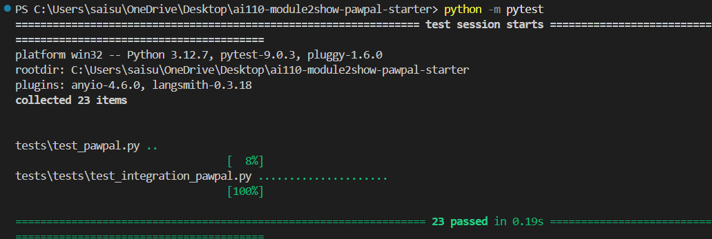

# PawPal+ (Module 2 Project)

You are building **PawPal+**, a Streamlit app that helps a pet owner plan care tasks for their pet.

## Scenario

A busy pet owner needs help staying consistent with pet care. They want an assistant that can:

- Track pet care tasks (walks, feeding, meds, enrichment, grooming, etc.)
- Consider constraints (time available, priority, owner preferences)
- Produce a daily plan and explain why it chose that plan

Your job is to design the system first (UML), then implement the logic in Python, then connect it to the Streamlit UI.

## What you will build

Your final app should:

- Let a user enter basic owner + pet info
- Let a user add/edit tasks (duration + priority at minimum)
- Generate a daily schedule/plan based on constraints and priorities
- Display the plan clearly (and ideally explain the reasoning)
- Include tests for the most important scheduling behaviors

## Getting started

### Setup

```bash
python -m venv .venv
source .venv/bin/activate  # Windows: .venv\Scripts\activate
pip install -r requirements.txt
```

### Suggested workflow

1. Read the scenario carefully and identify requirements and edge cases.
2. Draft a UML diagram (classes, attributes, methods, relationships).
3. Convert UML into Python class stubs (no logic yet).
4. Implement scheduling logic in small increments.
5. Add tests to verify key behaviors.
6. Connect your logic to the Streamlit UI in `app.py`.
7. Refine UML so it matches what you actually built.

## 🖥️ Sample Output

The CLI entry point in `main.py` prints a simple, readable plan for each pet. A sample run looks like this:

```text
======================================================================
                   🐾 PAWPAL+ - PET CARE SCHEDULER 🐾                   
======================================================================

👤 Owner: Sarah Mitchell
   Timezone: EST
   Availability: weekday evenings and weekends

----------------------------------------------------------------------
🐕 PET 1: Creating Buddy the Dog...
   ✓ Added 5 tasks to Buddy

----------------------------------------------------------------------
🐱 PET 2: Creating Whiskers the Cat...
   ✓ Added 5 tasks to Whiskers

----------------------------------------------------------------------
📅 Generating Today's Schedules...

======================================================================
                          📋 TODAY'S SCHEDULE                          
======================================================================

======================== BUDDY ========================
Species: dog
Time budget: 120 min
Scheduled: 5 task(s) | Used: 110 min | Remaining: 10 min

Scheduled tasks:
  • Breakfast            | 15 min | MUST_DO | [08:00-08:15]
  • Morning Walk         | 30 min | HIGH    | [08:00-08:30]
  • Dinner               | 15 min | MUST_DO | [17:00-17:15]
  • Afternoon Walk       | 30 min | HIGH    | [17:00-17:30]
  • Training Session     | 20 min | MEDIUM  | [18:00-18:20]

====================== WHISKERS ======================
Species: cat
Time budget: 90 min
Scheduled: 5 task(s) | Used: 50 min | Remaining: 40 min

Scheduled tasks:
  • Breakfast            | 10 min | MUST_DO | [08:00-08:10]
  • Medication           |  5 min | MUST_DO | [10:00-10:05]
  • Dinner               | 10 min | MUST_DO | [17:00-17:10]
  • Lunch                | 10 min | MEDIUM  | [13:00-13:10]
  • Play & Enrichment    | 15 min | MEDIUM  | [15:00-15:15]
```

## 🧪 Testing PawPal+

Run the full suite with:

```bash
python -m pytest
```

The tests verify core scheduler behavior, including:

- task sorting order by preferred time window
- recurring task creation for daily and weekly tasks
- conflict detection for overlapping task time windows
- plan generation and task filtering logic


Sample test output:

```

```

## Features

- Sorting by time windows (`Scheduler.sort_by_time()`): orders pending tasks by preferred start time so the schedule feels natural and time-aware.
- Priority-aware task selection (`Scheduler.generate_plan()`): chooses the highest-priority and most time-sensitive tasks that fit within the pet's available minutes.
- Conflict warnings (`Scheduler.detect_conflicts()`): detects overlapping preferred time windows and surfaces readable warnings in the UI.
- Daily recurrence handling (`Task.mark_complete()`): creates the next occurrence for `daily` and `weekly` tasks so recurring care stays on the schedule.
- Task filtering (`Scheduler.filter_tasks()`): shows only pending tasks for the selected pet and hides completed items from the active todo view.
- Plan explanation (`DailyPlan.summary()` and `DailyPlan.explain()`): generates human-readable plan summaries and reasons for why tasks were included or dropped.

## Demo Walkthrough

### Main UI features

- Add owner and pet details at the top of the page.
- Create pet care tasks with a title, duration, and priority.
- See the current pet's pending tasks in a table sorted by preferred time window.
- Generate a daily schedule with a single click.
- Review conflict warnings and the generated plan explanation directly in the app.

### Example workflow

1. Enter an owner name and add a new pet using the **Add a Pet** section.
2. Add tasks for that pet in the **Add a Task** section, including duration and priority.
3. Observe the pending task table, which shows tasks sorted by time window and filtered to the current pet.
4. Click **Generate schedule** to build that pet's daily plan.
5. If there are overlapping tasks, the app shows conflict warnings; otherwise it displays the scheduled plan and reasoning.

### Key scheduler behaviors shown

- Sorting tasks by preferred start time so morning and evening care appear in a natural order.
- Filtering tasks to only show pending work for the active pet.
- Warning the user when two tasks overlap in the same time window.
- Greedily fitting the highest-priority tasks into each pet's time budget.
- Explaining why tasks were included or dropped in the final plan.

### Sample CLI output

Run the CLI entry point with:

```bash
python main.py
```

Example output:

```text
======================================================================
                   🐾 PAWPAL+ - PET CARE SCHEDULER 🐾                   
======================================================================

👤 Owner: Sarah Mitchell
   Timezone: EST
   Availability: weekday evenings and weekends

----------------------------------------------------------------------
🐕 PET 1: Creating Buddy the Dog...
   ✓ Added 5 tasks to Buddy

----------------------------------------------------------------------
🐱 PET 2: Creating Whiskers the Cat...
   ✓ Added 5 tasks to Whiskers

----------------------------------------------------------------------
📅 Generating Today's Schedules...

======================================================================
                          📋 TODAY'S SCHEDULE                           
======================================================================

======================== BUDDY ========================
Species: dog
Time budget: 120 min
Scheduled: 5 task(s) | Used: 110 min | Remaining: 10 min

Scheduled tasks:
  • Breakfast            | 15 min | MUST_DO | [08:00-08:15]
  • Morning Walk         | 30 min | HIGH    | [08:00-08:30]
  • Dinner               | 15 min | MUST_DO | [17:00-17:15]
  • Afternoon Walk       | 30 min | HIGH    | [17:00-17:30]
  • Training Session     | 20 min | MEDIUM  | [18:00-18:20]

====================== WHISKERS ======================
Species: cat
Time budget: 90 min
Scheduled: 5 task(s) | Used: 50 min | Remaining: 40 min

Scheduled tasks:
  • Breakfast            | 10 min | MUST_DO | [08:00-08:10]
  • Medication           |  5 min | MUST_DO | [10:00-10:05]
  • Dinner               | 10 min | MUST_DO | [17:00-17:10]
  • Lunch                | 10 min | MEDIUM  | [13:00-13:10]
  • Play & Enrichment    | 15 min | MEDIUM  | [15:00-15:15]
```

**Optional screenshot or video**: add one if you want to show the Streamlit app visually.
